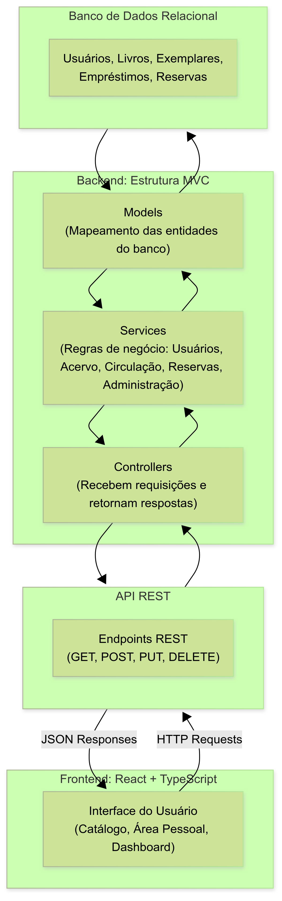

# N705 - Projeto Aplicado Multiplataforma Etapa 1

## 1. Título e descrição do projeto

**BiblioConecta** é uma plataforma desenvolvida para modernizar a interação entre bibliotecas e seus usuários. A solução permite:

- Consultar o catálogo de livros online;
- Verificar a disponibilidade de livros;
- Gerenciar empréstimos e reservas de forma remota.

Para a equipe da biblioteca, o sistema oferece um painel administrativo que otimiza a gestão do acervo e o controle de circulação dos livros.

---

## 2. Problema abordado e justificativa

O projeto busca resolver o distanciamento entre a biblioteca e seus usuários, causado pela ausência de ferramentas digitais que atendam às expectativas atuais de acesso à informação. 

Principais dificuldades enfrentadas pelos usuários:

- Ausência de catálogo online;
- Impossibilidade de verificar, sem ir presencialmente, se o livro desejado está disponível;
- Dependência do espaço físico para renovar empréstimos ou solicitar reservas.

**Justificativa:** O projeto traz acessibilidade, praticidade e modernização, incentivando o uso do acervo e otimizando a gestão da equipe da biblioteca.

**Públicos-alvo:**

1. **Usuários da comunidade:** necessitam de acesso rápido e prático para consultar, reservar ou renovar livros.  
2. **Equipe da biblioteca:** bibliotecários, assistentes e administradores que precisam de uma ferramenta simples para organizar e automatizar tarefas diárias.

---

## 3. Objetivos do sistema

- Permitir consulta online ao acervo de livros;
- Viabilizar reservas e renovações sem necessidade de presença física;
- Oferecer painel administrativo para bibliotecários com funções de cadastro e controle de circulação;
- Modernizar o relacionamento entre biblioteca e comunidade.

---

## 4. Escopo do projeto

- **Frontend:** Desenvolvimento da aplicação web responsiva, com interfaces para usuários e administradores, garantindo navegação intuitiva e interação direta com o backend.  
- **Backend:** Implementação da API REST para gerenciamento de usuários, livros, reservas, empréstimos e avaliações.  
- **Banco de dados:** Modelagem e armazenamento das informações de usuários, livros, exemplares, reservas, empréstimos e avaliações.  
- **Autenticação e autorização:** Sistema de login seguro com JWT, diferenciando perfis de usuários e administradores.  

---

## 5. Visão geral da arquitetura

- **Backend:** Aplicação monolítica em Node.js com TypeScript, centralizando regras de negócio e acesso ao banco de dados.  
- **Frontend:** SPA em React com TypeScript, responsável pela interface e experiência do usuário.  
- **Comunicação:** Exclusivamente via API REST entre frontend e backend.  

---

## 6. Tecnologias propostas

- **Backend:** Node.js + TypeScript, API REST  
- **Frontend:** React + TypeScript, SPA responsiva  
- **Banco de dados:** MySQL ou PostgreSQL  
- **Autenticação:** JWT  

---

## 7. Cronograma para Etapa 2 (N708)

| Etapa | Atividade | Período | Responsável |
|-------|------------|----------|-------------|
| 1 | Modelagem final do banco de dados | Semana 1 | Equipe Backend |
| 2 | Desenvolvimento da API REST (usuários, livros, empréstimos) | Semanas 2-3 | Equipe Backend |
| 3 | Desenvolvimento do frontend (telas principais) | Semanas 3-4 | Equipe Frontend |
| 4 | Integração frontend + backend | Semana 5 | Todos |
| 5 | Testes, ajustes e documentação final | Semana 6 | Todos |

---

## 8. Integrantes da equipe e responsabilidades

| Nome | Matrícula | Papel/Responsabilidade |
|------|-----------|----------------------|
| Alisson (inserir matrícula) | (inserir) | Arquitetura / Integração |
| Antonio Mikael Vasconcelos Aguiar | 2326335 | Backend |
| Rafael (inserir matrícula) | (inserir) | Designer |
| Renato (inserir matrícula) | (inserir) | Backend |
| Sandy Rodrigues do Nascimento | 2326334 | Product Owner |
| Vitória de Oliveira Almeida | 2325332 | Designer |

