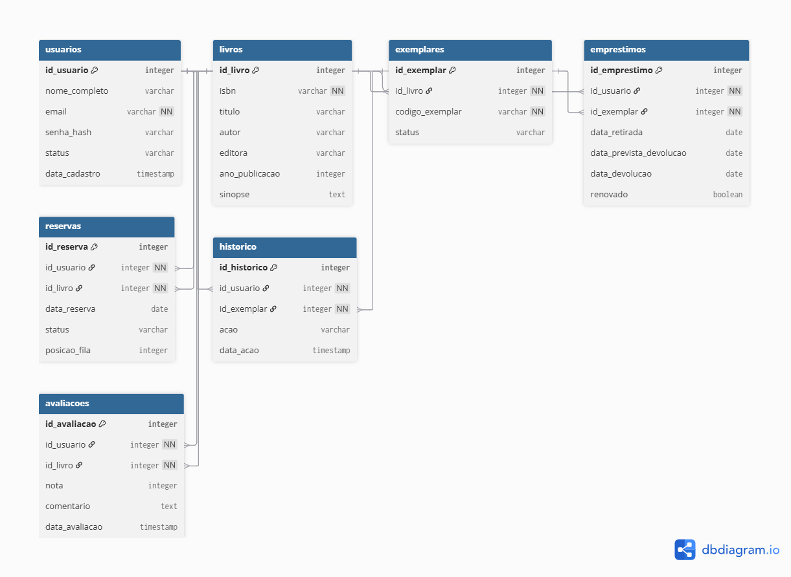

# 📘 Modelo de Dados - BiblioConecta

// BiblioConecta - Modelo de Dados

Table usuarios {
  id_usuario integer [primary key, increment]
  nome_completo varchar
  email varchar [unique, not null]
  senha_hash varchar
  status varchar // Ativo | Bloqueado
  data_cadastro timestamp
}

Table livros {
  id_livro integer [primary key, increment]
  isbn varchar [unique, not null]
  titulo varchar
  autor varchar
  editora varchar
  ano_publicacao integer
  sinopse text
}

Table exemplares {
  id_exemplar integer [primary key, increment]
  id_livro integer [not null]
  codigo_exemplar varchar [unique, not null]
  status varchar // Disponível | Emprestado | Reservado
}

Table emprestimos {
  id_emprestimo integer [primary key, increment]
  id_usuario integer [not null]
  id_exemplar integer [not null]
  data_retirada date
  data_prevista_devolucao date
  data_devolucao date
  renovado boolean
}

Table reservas {
  id_reserva integer [primary key, increment]
  id_usuario integer [not null]
  id_livro integer [not null]
  data_reserva date
  status varchar // Ativa | Atendida | Expirada
  posicao_fila integer
}

Table historico {
  id_historico integer [primary key, increment]
  id_usuario integer [not null]
  id_exemplar integer [not null]
  acao varchar // Emprestimo | Devolucao | Renovacao | Reserva
  data_acao timestamp
}

Table avaliacoes {
  id_avaliacao integer [primary key, increment]
  id_usuario integer [not null]
  id_livro integer [not null]
  nota integer // escala 1 a 5
  comentario text
  data_avaliacao timestamp
}

// ==============================
// Relacionamentos
// ==============================

// Usuario -> Emprestimos
Ref: emprestimos.id_usuario > usuarios.id_usuario

// Usuario -> Reservas
Ref: reservas.id_usuario > usuarios.id_usuario

// Livro -> Exemplares
Ref: exemplares.id_livro > livros.id_livro

// Exemplar -> Emprestimos
Ref: emprestimos.id_exemplar > exemplares.id_exemplar

// Livro -> Reservas
Ref: reservas.id_livro > livros.id_livro

// Usuario -> Historico
Ref: historico.id_usuario > usuarios.id_usuario

// Exemplar -> Historico
Ref: historico.id_exemplar > exemplares.id_exemplar

// Usuario -> Avaliacoes
Ref: avaliacoes.id_usuario > usuarios.id_usuario

// Livro -> Avaliacoes
Ref: avaliacoes.id_livro > livros.id_livro
