## 👤 Telas de Usuário (Mobile)

  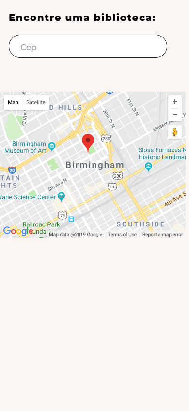
  
  

  
  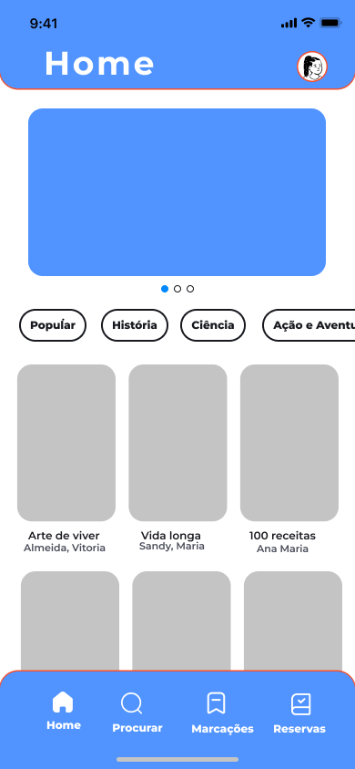
  

  
  
  

  
  
  

  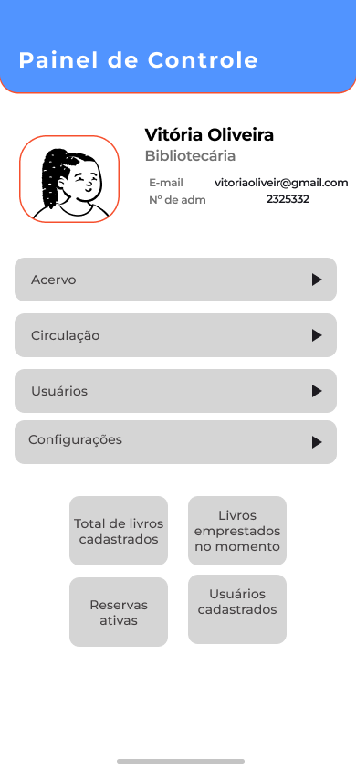
  

---

## 🛠️ Telas de Administrador (Mobile)

  
  
  

  
  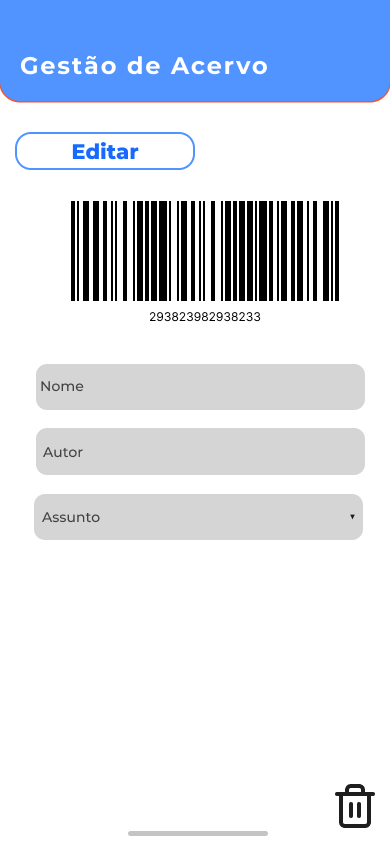
  

  
  
  

  

---

## 💻 Telas de Usuário (Web)

  
  
  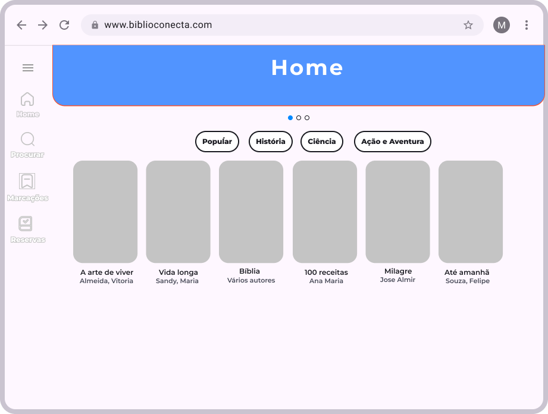

  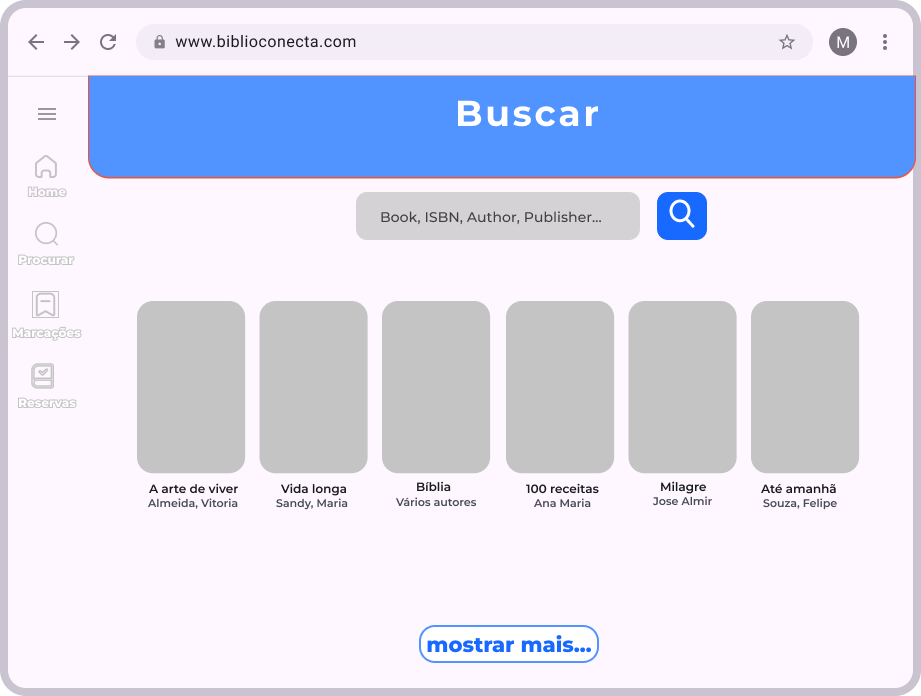
  
  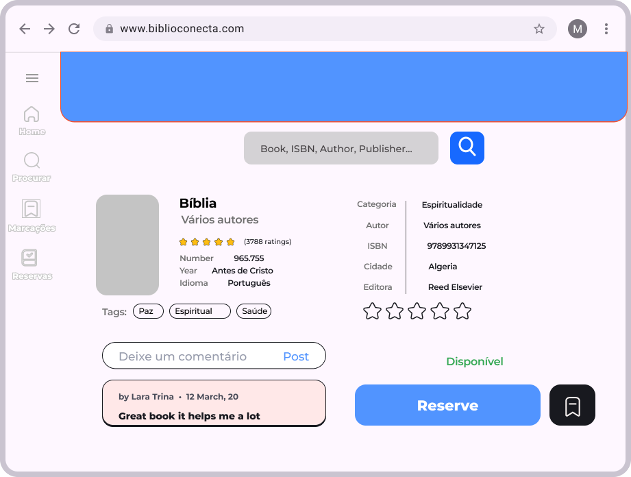

  
  
  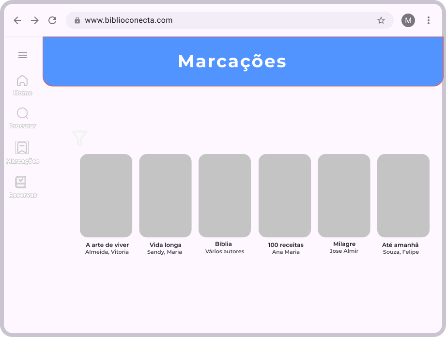

  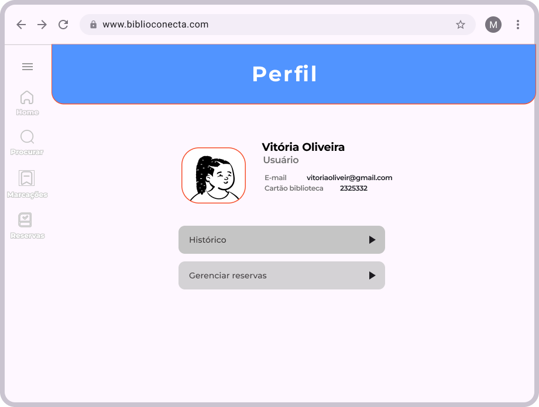

---

## 🛠️ Telas de Administrador (Web)

  
  
  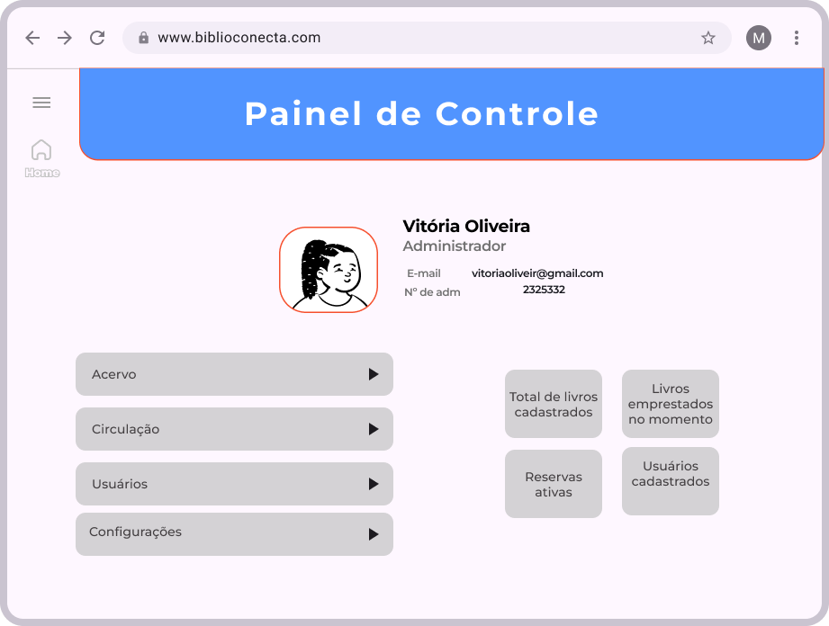

  
  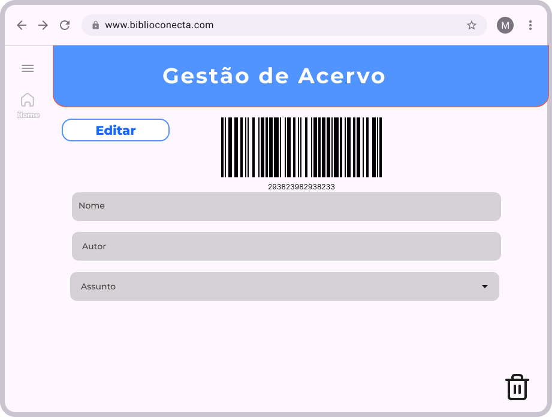
  

  
  
  

  

